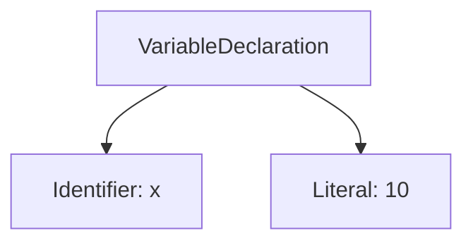
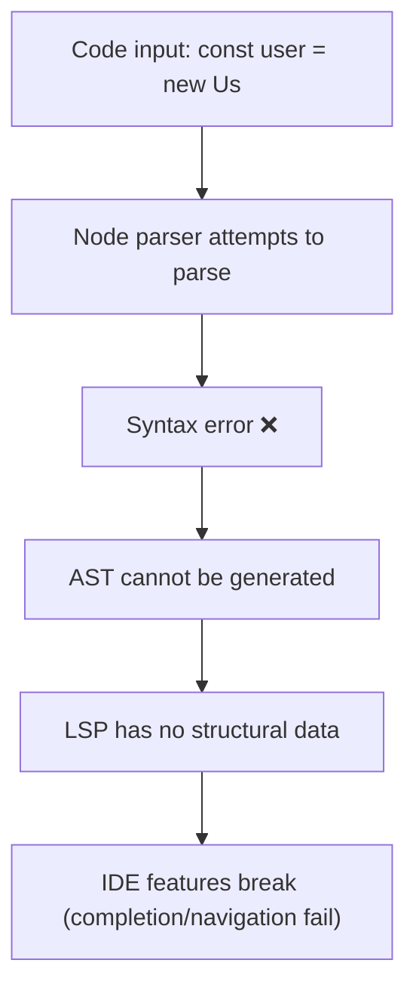
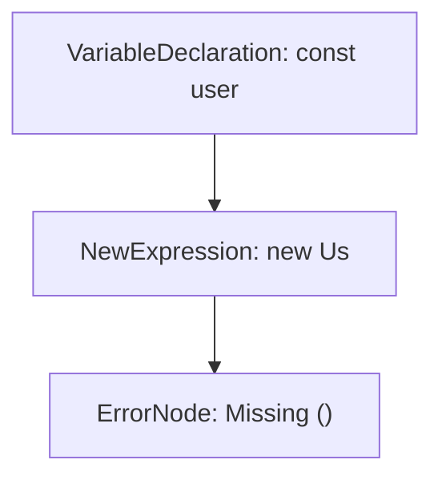
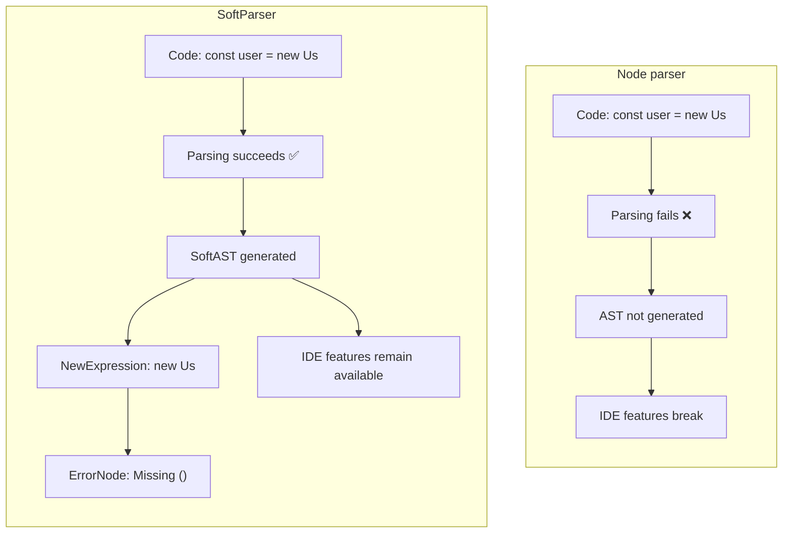

# Alphium Replaces Node Parser with SoftParser: What's the Impact on Our Developer Experience?

I recently saw an update from Alphium announcing a change to their Language Server Protocol (LSP). They swapped out the original **Node parser for SoftParser**. To many developers, this might seem like a minor, low-level detail, not as exciting as a new framework or feature. But if you think about it, it actually affects the most frustrating part of our daily experience in VSCode, Cursor, or Windsurf: **Why do my IDE's smart features suddenly break when I'm in the middle of writing code?**


## Why Do Our IDEs "Suddenly Break"?

If you've ever installed plugins like TypeScript, ESLint, or Prettier, you're familiar with features like auto-completion, jump to definition, and real-time error highlighting. Most of the time, they work great, but occasionally, you run into a situation where the code is still incomplete—for example, a parenthesis is missing or you're only halfway through typing a variable name—and these features just stop working. Autocomplete disappears, "Go to Definition" is broken, and error highlighting is gone.

Many people's first reaction is to blame the editor itself. But the truth is, it's not VSCode or Cursor's fault; it's because the underlying **Language Server (LSP)** isn't able to function properly.


## The Role of LSP: The IDE's Smart Brain


The Language Server Protocol (LSP) is the fundamental architecture that provides modern IDEs with their intelligent features. The editor itself is just an interface for displaying and editing text, while the LSP acts as the "brain," responsible for understanding your code and responding to various requests, such as:

  * Where is this variable defined? (Go to Definition)
  * Where is this function used? (Find References)
  * What are the suggested completions as I type? (Auto-Completion)
  * Is there an error in this code? (Linting & Error Highlighting)

To do any of this, the LSP first needs to understand the structure of the code. A computer can't "roughly understand" code like a human; it needs a strict, structured representation. The core step in creating this structure is the **Parser**, which converts the raw text of the code into an Abstract Syntax Tree (AST). This gives the LSP the foundation it needs to provide its smart features.


## The Parser: From Text to Structure

A parser's job is to convert a string of code into an AST. Think of an AST as a **"structured representation of code"** that breaks down a long string of text into a tree-like data structure that a computer can understand.

For example, the following JavaScript code:

```js
let x = 10;
```

After being processed by a parser, it becomes an AST:

```
VariableDeclaration
 ├─ Identifier("x")
 └─ Literal(10)
```



This tree clearly describes the code as a variable declaration with the name `x` and a numerical literal value of `10`.

The importance of the AST lies in its ability to transform "string code" into a "data structure that a computer can manipulate." This is what allows the LSP to provide features like autocomplete as you type, jumping to a definition when you click, refactoring when you modify code, and checking for errors in the background. Without an AST, the LSP has no foundation, and none of its smart features can function correctly.

Since the AST is so crucial, the next logical question is: in the world of JavaScript, who is responsible for generating it?
The answer is the Node parser, which comes from the V8 engine and is currently the most widely used JavaScript syntax parser.


## Node Parser: Strict but Not Developer-Friendly

In the JavaScript world, the most common parser comes from the [V8 engine](https://v8.dev/), which is what Node.js and Chrome use. The biggest characteristic of the Node parser is its **strictness**. It fully adheres to the [ECMAScript standard](https://en.wikipedia.org/wiki/ECMAScript), which guarantees high accuracy. However, if the code has any syntax errors, it will throw an error and refuse to generate the AST.

This design is perfectly reasonable for a production environment. We don't want incorrect code to be executed, so the compiler should stop immediately when it encounters an error. However, this poses a big problem for the development environment, because humans write code in an "incomplete" state about 90% of the time. For example:

```ts
const user = new Us
```

This line of code is unfinished. The Node parser will immediately throw an error → the AST disappears → the LSP loses its foundation → the IDE's smart features instantly fail. This is the real reason why the "features suddenly break" so often when we're writing code.




## SoftParser: The Non-Interruptive Solution

SoftParser was developed to address this issue. Its design philosophy is simple: **generate an AST no matter what, even if the code is incorrect.**

When the code has an error, SoftParser doesn't fail entirely. Instead, it outputs a "fault-tolerant AST (SoftAST)" and inserts an **ErrorNode** at the location of the error. This way, the AST structure remains complete, and the LSP can continue to function. The result is that even when your code is in a half-finished state, the IDE's completion, navigation, and refactoring features don't stop working.

Even better, SoftParser doesn't just keep IDE features from breaking. Its design also addresses another flaw of traditional parsers. Most traditional syntax parsers, like the Node parser, are "unidirectional": they can only convert code into an AST, and in the process, they lose some information, such as whitespace, indentation, comments, and even erroneous tokens. While such an AST is sufficient for executing code or performing static analysis, it can't be perfectly converted back into the original code.

SoftParser is different. It preserves all details within the AST, allowing it to support a bidirectional AST ↔ source code conversion. This means it can not only generate an AST from code but also completely restore the original source code from the AST, without losing comments or whitespace. This is crucial for Formatter and Refactor tools, which need to switch back and forth between "understanding the code structure" and "outputting the code." SoftParser fills this capability gap.

Additionally, it supports incremental parsing, which means it only re-parses the modified parts of the code, avoiding the need to re-run the entire file and improving performance. For error handling, SoftParser goes a step further by not only reporting the first error, like Node parser does, but also collecting multiple errors at once and marking their precise locations.

### Example: The Incomplete Code Scenario

Let's say we're in the middle of typing:

```ts
const user = new Us
```

To the **Node parser**, this code is invalid because `new Us` is not complete (it's missing parentheses). As a result, it throws an error, no AST is generated, and the LSP features break.

**SoftParser** handles this differently. It still outputs an AST, but it adds an **ErrorNode** where the code is incomplete. This allows the LSP to still understand most of the structure through the AST, and its features don't stop working.

### SoftAST Structure Diagram



This tree shows:

  * The root node is the variable declaration `user`
  * Its value is a **NewExpression (`new Us`)**
  * But because the syntax is incomplete, SoftParser inserted an **ErrorNode** to mark "Missing ()"

### Comparison of Differences

  * **Node parser**: Incomplete code → Throws an error → AST disappears → IDE features break
  * **SoftParser**: Incomplete code → Generates a SoftAST + ErrorNode → IDE features remain available

<!-- end list -->




## AI IDEs vs. LSP IDEs: Different Sources of Intelligence

Now that we understand the roles of the Parser and LSP, a question naturally arises: since AI IDEs like Cursor and Windsurf can also provide completions as I type, do they work the same way as a parser?

The answer is no, because they operate on completely different principles.

Traditional LSP-based IDEs (like VSCode with TypeScript or ESLint plugins) are **"structure-driven."** They must first use a Parser to generate an AST, and then the LSP uses the AST to provide features. The advantage of this approach is that the results are accurate and explainable—you can clearly see "where this variable is defined, and where this function is called." But the disadvantage is also obvious: once the AST is gone (e.g., the code is incomplete or has a syntax error), the LSP loses its foundation, and its features fail entirely.

AI IDEs, on the other hand, take a completely different path. They are **language model-driven** and can function without an AST. When Cursor or Copilot Chat provide completions, they rely on a large language model (LLM) to directly "predict" what you might type next based on the context. This means they aren't bothered by incomplete code, because an LLM is inherently good at guessing the next step in a "missing-word, missing-phrase" state. This approach allows for more "creative completions," but the downside is that it's probabilistic—the model might guess wrong or even generate code that doesn't follow syntax rules.

The ideal state isn't one or the other; it's a combination of both. The introduction of SoftParser allows the LSP to maintain its structural capabilities even when the code is incomplete. AI IDEs then build on this foundation by adding more flexible contextual understanding and suggestions. The former acts like a **"rule-based brain,"** ensuring correctness and consistency, while the latter acts as a **"creative brain,"** helping developers write code faster and more naturally. When paired together, they create a complete and modern developer experience.

### Comparison Example

Let's go back to our code example:

```ts
const user = new Us
```

The outcome would be very different depending on the system:

  * **Node parser**: Throws an error → AST disappears → IDE features break
  * **SoftParser**: Generates a SoftAST with an error node → IDE can still suggest `User` or `UserService`
  * **AI IDE**: Even without an AST, it can guess based on context and might even complete the code to `new UserService()`


## Limitations and Future Outlook

SoftParser is not a magic bullet. It still relies on the Node parser for type inference, so type checking remains strict. And while it has high test coverage, it's still a new technology and hasn't had the same decade-plus of real-world validation as the Node parser. However, as more features (like rename, completion, and inlay hints) gradually switch to SoftParser, we can expect IDE smart features to become more stable and non-interruptive.


## Conclusion: The Strict Teacher and the Gentle Tutor

If we use a metaphor, the Node parser is like a strict teacher who returns the entire test paper if they find a single typo. SoftParser, on the other hand, is like a gentle tutor who marks the mistakes but continues to grade the rest of the paper for you. The former ensures correctness, while the latter ensures continuity. They are not mutually exclusive but complementary.

Alphium's recent update is more than a low-level technical change; it's a significant upgrade to the developer experience. It signals that the IDE of the future should be **fault-tolerant, stable, and non-interruptive**, with the added assistance of AI IDEs to make development both correct and efficient.