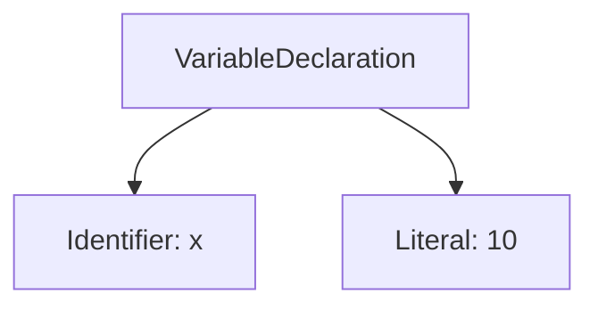
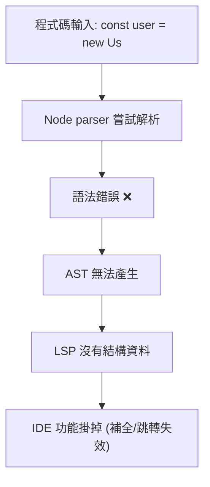
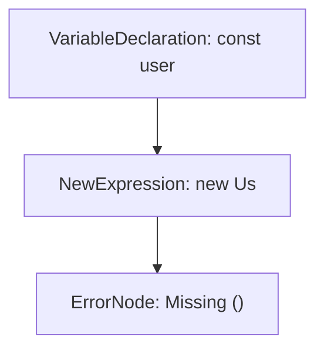
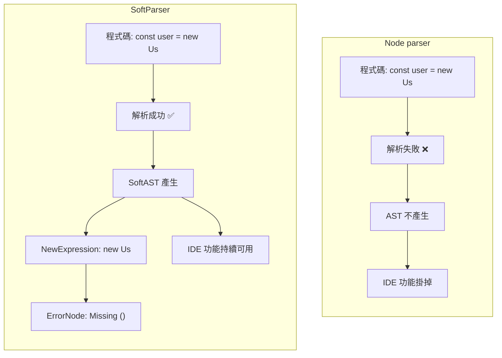

# Alphium 換掉了 Node parser，改用 SoftParser 這對我們的開發體驗有什麼影響？


前陣子我注意到 Alphium 的[一則更新公告](https://x.com/ALPH_CNintern/status/1958088949731045535)，他們在 LSP（Language Server Protocol）裡，把原本使用的 **Node parser 換成了 SoftParser**。對許多工程師來說，這聽起來可能只是個底層細節，不像新框架或新功能那樣引人注目。但仔細想想，它其實關係到我們每天在 VSCode、Cursor 或 Windsurf 裡最真實的體驗：**為什麼我打程式打到一半時，IDE 的智慧功能會突然壞掉？**


## IDE 為什麼會「突然壞掉」？


如果你平常有安裝過 TypeScript、ESLint 或 Prettier 這些插件，你一定對自動補全、跳轉定義、即時錯誤提示這些功能很熟悉。大部分時間它們都很好用，但偶爾卻會遇到一個狀況，當程式碼還在半完成狀態，例如括號還沒補上、變數才輸入到一半，這些功能就突然消失了。補全不再彈出，Go to Definition 也跳不動，錯誤提示甚至整個不見。


很多人第一反應會以為這是編輯器本身的問題，但事實上這不是 VSCode 或 Cursor 的錯，而是背後的 **Language Server (LSP)** 沒辦法正常運作。


## LSP 的角色：IDE 的智慧大腦


LSP（Language Server Protocol）是現代 IDE 裡提供智慧功能的基礎架構。編輯器本身只是顯示和編輯文字的介面，而 LSP 則像是「大腦」，負責理解程式碼，並回應各種需求，例如：


* 這個變數的定義在哪裡？（Go to Definition）

* 這個函式被用在哪些地方？（Find References）

* 我輸入到一半，有哪些候選？（Auto Completion）

* 這段程式碼有沒有錯？（Lint & Error 提示）


要做到這些事，LSP 必須先知道程式碼的結構。而電腦無法像人類一樣「大概看懂」，它需要一個嚴格、結構化的表示方式。產生這個結構的核心步驟，就是 **Parser** 把原本的程式文字轉換成一棵抽象語法樹（AST），讓 LSP 有依據去判斷和提供功能。


## Parser：從文字到結構


Parser 的任務，就是把程式碼這串文字轉換成 AST（抽象語法樹）。AST 可以想成是「程式碼的結構化表示法」，它把原本一長串字串，拆解成電腦能理解的樹狀資料結構。


舉例來說，下面這段 JavaScript：


```js

let x = 10;

```


經過 Parser 處理後，會變成一棵 AST：


```

VariableDeclaration

├─ Identifier("x")

└─ Literal(10)

```





這棵樹清楚描述了這是一個變數宣告，名稱是 x，值是一個數字常數 10。


AST 的重要性在於，它把「字串程式碼」轉換成「電腦可以操作的資料結構」。這樣一來，LSP 才能基於 AST 提供功能，在你輸入時給出補全、在你點擊時跳轉到定義、在你修改時重構，甚至在背景檢查錯誤。沒有 AST，LSP 就失去依據，任何智慧功能都無法正常工作。


既然 AST 這麼關鍵，那問題來了，在 JavaScript 的世界裡，究竟是誰負責產生 AST？

答案是 Node parser，它來自 V8 引擎，是目前最廣泛使用的 JavaScript 語法解析器。


## Node parser：嚴格但不夠貼近開發


在 JavaScript 世界裡，最主流的 Parser 來自 [V8 引擎](https://v8.dev/)，也就是 Node.js 與 Chrome 都在用的那一套。Node parser 最大的特點就是「嚴格」。它完全遵循 [ECMAScript 標準](https://en.wikipedia.org/wiki/ECMAScript)，保證正確性高，但只要程式碼有任何語法錯誤，它就會報錯並拒絕產生 AST。


這種設計對生產環境來說非常合理。我們不希望錯誤的程式碼被執行，編譯器在面對錯誤程式時應該立刻停止。但對開發環境來說，這卻帶來了很大的問題。因為人類打程式碼時，幾乎九成時間都是「不完整」的。舉例來說：


```ts

const user = new Us

```


這段程式碼還沒打完。Node parser 會直接報錯 → AST 消失 → LSP 失去基礎 → IDE 的智慧功能瞬間失效。這就是我們平常寫程式時，常常遇到「功能突然掛掉」的真正原因。





## SoftParser：不中斷的解法


SoftParser 就是在這樣的背景下出現的。它的設計理念很直接：**無論程式碼是否正確，都要產生 AST**。


當程式碼有錯誤時，SoftParser 不會整個失敗，而是輸出一棵「容錯的 AST (SoftAST)」，並在錯誤位置插入一個 **錯誤節點 (ErrorNode)**。這樣一來，AST 結構依然完整，LSP 還能繼續運作。結果就是，即使程式碼還在半完成狀態，IDE 的補全、跳轉、重構都不會中斷。


更好的是，SoftParser 不只是讓 IDE 功能不中斷。它還在設計上補足了傳統 parser 的另一個缺陷。一般像 Node parser 這樣的傳統語法解析器，通常是「單向」的：它只能把程式碼轉換成 AST，但在這個過程裡會丟掉一些資訊，例如空格、縮排、註解，甚至錯誤的 token。這樣的 AST 雖然足夠用來執行程式或做靜態分析，但卻無法原封不動地還原回程式碼。


SoftParser 則不同，它在 AST 中保留了所有細節，因此可以支援 AST ↔ 原始碼的雙向轉換。這意味著它不只能從程式碼產生 AST，也能從 AST 完整地還原出原始程式碼，連註解和空格都不會消失。這對 Formatter 與 Refactor 工具來說非常重要，因為它們需要在「理解程式結構」和「輸出程式碼」之間來回切換，而 SoftParser 剛好補上了這個能力。


同時，它還支援 增量解析，也就是只重新解析修改過的部分，避免每次都要重跑整個檔案，效能更佳。而在錯誤處理上，SoftParser 也做得更進一步，不像 Node parser 那樣只能回報第一個錯誤，而是能一次收集多個錯誤，並且精準標記位置。


### 範例：程式碼不完整的情況


假設我們正在輸入：


```ts

const user = new Us

```


對 **Node parser** 來說，這段程式碼是不合法的，因為 `new Us` 還沒完成（缺少小括號）。結果就是它直接報錯，AST 不會被產生，LSP 功能也隨之停擺。


而 **SoftParser** 的做法不同。它仍然會輸出一棵 AST，只是在不完整的地方加上一個 **錯誤節點 (ErrorNode)**。這樣一來，LSP 還是能透過 AST 理解大部分結構，功能不中斷。


### SoftAST 結構示意





這張樹表示：


* 根節點是變數宣告 `user`

* 它的值是一個 **NewExpression (`new Us`)**

* 但因為語法不完整，SoftParser 插入了一個 **ErrorNode**，標記「缺少 ()」


### 差異說明


* **Node parser**：程式碼不完整 → 直接報錯 → AST 消失 → IDE 功能掛掉

* **SoftParser**：程式碼不完整 → 產生 SoftAST + ErrorNode → IDE 功能持續可用





## AI IDE 與 LSP IDE：不同的智慧來源


當我們理解了 Parser 與 LSP 的角色之後，自然會冒出一個疑問，既然像 Cursor、Windsurf 這樣的 AI IDE 也能在我打字時給出補全，它們的做法是不是和 Parser 一樣？


答案是否定的，因為兩者其實是完全不同的路徑。


傳統的 LSP 型 IDE（像 VSCode 搭配 TypeScript、ESLint 這類插件）是「結構驅動」的。它必須先透過 Parser 產生 AST，再由 LSP 根據 AST 提供功能。這樣的好處是結果準確、可解釋，你可以很清楚地知道「這個變數在哪裡定義、這個函式被呼叫在哪些地方」。但它的缺點也很明顯，一旦 AST 沒了（例如程式碼還沒打完、語法錯誤），LSP 就失去基礎，功能會整個掛掉。


AI IDE 則走的是完全不同的道路。它是語言模型驅動的，不需要 AST 也能運作。Cursor 或 Copilot Chat 在補全時，靠的是大型語言模型（LLM）從上下文直接「預測」你接下來可能要輸入什麼。這讓它不怕程式碼不完整，因為 LLM 本來就擅長在「缺字、缺詞」的狀態下猜下一步。這樣的方式帶來更多「創意補全」的可能，但缺點是機率性，模型可能會猜錯，甚至生成不符合語法規則的程式碼。


理想的狀態並不是擇一，而是兩者結合。SoftParser 的出現，讓 LSP 在程式碼錯誤的情況下仍能維持 AST，保持結構化的能力不中斷；AI IDE 則在這個基礎上，補上更靈活的上下文理解和建議。前者像是「規則腦」，保證正確性與一致性；後者則是「創意腦」，幫助開發者更快、更自然地寫程式。當兩者搭配時，才是完整而現代的開發體驗。


### 範例比較


回到剛才的程式碼：


```ts

const user = new Us

```


對不同的系統來說，結果會很不一樣：


* **Node parser**：報錯 → AST 消失 → IDE 功能壞掉

* **SoftParser**：產生 SoftAST，插入錯誤節點 → IDE 仍能提示 `User`、`UserService`

* **AI IDE**：即使沒有 AST，它也能根據上下文猜測，甚至直接幫你補成 `new UserService()`


## 限制與展望


SoftParser 並不是萬能的。它目前仍然依賴 Node parser 來做類型推斷，所以在型別檢查上還是嚴格。它雖然有很高的測試覆蓋率，但畢竟是新技術，還沒有像 Node parser 那樣經過十幾年的實戰驗證。不過，隨著更多功能（例如 rename、completion、inlay hints）逐步切換到 SoftParser，我們可以期待 IDE 的智慧功能變得更穩定、不中斷。


## 結語：嚴師與助教


如果要用一個比喻，Node parser 就像嚴格的老師，看到錯字就把整份考卷退回；SoftParser 則像溫柔的助教，會在錯的地方標註，但整份卷子還是幫你批改完。前者保證正確性，後者確保不中斷。兩者不是互斥，而是互補的。


Alphium 這次的更新，不只是一個底層的技術調整，而是對開發體驗的升級。它代表未來的 IDE 應該是這樣的：**容錯、穩定、不中斷**，再加上 AI IDE 的輔助，讓開發既正確又高效。