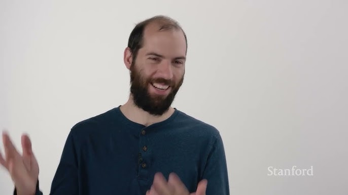

**這是 AI 找到它之前的故事。**

## Ghost 從來沒有出過嚴重漏洞

在 2026 年初的某個下午，一個研究員在自己的筆電上起了一個 Docker container，裡面跑著一套叫做 Ghost 的內容管理系統。Ghost 是一個頗受歡迎的開源 CMS，GitHub 上有五萬顆星，許多獨立媒體、個人部落格、新聞電子報都建立在它之上。在這個軟體的整個存在歷史裡，從來沒有出現過一個「嚴重」等級的安全漏洞。

這個紀錄，在那天下午結束了。

那個研究員叫 Nicholas Carlini，在 Anthropic 工作。他打開一個 bash 腳本，腳本裡有幾十行程式碼，其中一部份的核心邏輯是這樣的，給 Claude 一個提示，說你正在玩 CTF，請審計這個 codebase 的安全性，找到漏洞，把最嚴重的那個寫進這個輸出檔案。然後 Carlini 去做了別的事。

模型找到了一個 SQL injection。

這本身還不算太驚人，SQL injection 是資安界的老朋友，已經存在了幾十年，每個人都知道它是問題，每個人都知道怎麼防範，但它就是一直在各種軟體裡浮出來。真正讓 Carlini 皺眉的是接下來發生的事：他問模型，這個漏洞的最壞情況是什麼？能利用到什麼程度？

模型寫了一個完整的攻擊程式。

不是一個概念驗證，不是一個草稿，而是一個可以跑的 blind SQL injection exploit。所謂「blind」，意思是攻擊者看不到查詢的輸出，只能根據請求的回應時間或錯誤狀態來推斷資料庫裡有什麼。這需要某種程度的技巧，你需要把問題二元化，做二分搜尋，一個位元一個位元地讀出你想要的值。模型把這整件事都自動完成了。

在 Carlini 的簡報裡，他跑了一個現場 demo。左邊視窗是運行中的 Ghost 實例，右邊是攻擊程式。他按下執行，幾秒鐘之內，螢幕上印出了完整的 admin API 金鑰、密碼的 bcrypt hash、以及所有可以用來接管這個實例的憑證。

沒有認證。沒有權限。任何人，只要能連上這台伺服器，就可以完整接管它。

Carlini 說了一句讓整個會場安靜下來的話。

「這個攻擊我可能自己也能寫出來。但我不需要任何資安經驗就讓這件事發生了。」

## 我們花了幾十年建立的那道門

要理解這件事為什麼重要，得先理解「找零時差漏洞」在傳統上是一件多困難的事。

資安研究有一個很特別的知識結構。你不能只是聰明，你需要聰明加上特定的，深度的，往往是靠大量的失敗積累起來的直覺。你需要知道有哪些「漏洞類別」：buffer overflow、use-after-free、SQL injection、format string、整數溢出，以及幾十種其他的變體。你需要知道這些漏洞在程式碼裡長什麼樣子。你需要知道哪些地方值得看，哪些地方可以跳過。你需要有一種感覺，感覺到「這個地方有點怪」，然後往那個怪的方向繼續挖。

這種直覺是不可教的，或者說，它只能用時間和大量的實際接觸來建立。一個頂級的漏洞研究員，他的核心資產是看過幾百個漏洞之後形成的模式識別能力，以及知道「在這類程式碼裡，這個地方最容易出問題」的判斷力。

在這個傳統的世界裡，有一個工具叫做模糊測試（fuzzing）。你寫一個「harness」，把亂數或半隨機的輸入不斷地餵給程式，看看有沒有什麼輸入會讓程式崩潰。Google 有一個叫做 OSS-Fuzz 的服務，把這件事系統化，對數千個開源專案持續跑模糊測試，幾年下來找到了大量的漏洞。在 2016 年前後，各大安全機構開始大規模部署 fuzzing，找到了一批又一批的 CVE，每個媒體 codec 幾乎都有人翻出十個八個漏洞。

但 fuzzing 有一個根本的限制：它是暴力搜尋。它不理解程式碼在做什麼，它只是猛丟輸入，等待崩潰。對那些需要「特定結構」才能觸發的漏洞，它幾乎無能為力。幾年之後，模糊測試能找到的那類漏洞基本上都被找完了，曲線趨於平坦，大家繼續跑 fuzzer，但新的發現越來越少。

資安的「前線」回到了那些需要人類直覺的地方。

## 腳本只有三十行

Carlini 在 conference talk 裡給大家看了他的 scaffold。整個系統的核心，就是那麼一點點東西。

`claude --dangerously-skip-permissions`，這個參數的意思是：不要問我任何問題，不要要求確認，直接去做。然後是一個提示，說你在玩一個 CTF，找到最嚴重的漏洞，把結果寫進這個輸出檔案。僅此而已。

這個設置缺了兩個顯而易見的東西，缺了它之後系統「有點不夠徹底」。第一，同樣的 prompt 跑十次，模型大概會找到同樣的漏洞十次，因為它的思路是可預期的。第二，它不夠全面，它會看部分程式碼，但不是所有程式碼。

Carlini 的解決方法是再加一行：「請從這個檔案開始看」，然後用一個迴圈把專案裡每一個「看起來有安全相關內容」的檔案輪流餵進去，作為不同的入口點。他連「哪些檔案看起來跟安全有關」這個判斷也外包給模型：跑一次預篩，讓模型對每個檔案評一個一到五分，然後只保留三分以上的。

就這樣。一個 for 迴圈加上兩個 prompt，對一個有五萬顆 GitHub 星的專案，找到了它有史以來第一個嚴重漏洞。

在 podcast 裡，Carlini 說他連那個主要的 prompt 都不是自己寫的。他告訴 Claude 他要做什麼，讓 Claude 幫他寫了那個去找漏洞的 agent。

當一個人的安全研究工具包的起點是「我叫 AI 幫我寫了那個 AI」，這句話的含義值得在心裡多放一秒鐘。

## 二十二年前埋下的地雷

但 Ghost 的故事還只是這場演講的暖場。

Linux kernel 是一個不同量級的目標。它可能是地球上被審查最仔細的程式碼之一，幾十年來有無數的安全研究員、學術機構、政府機關和企業花費大量資源去找它的漏洞。拿到一個 Linux kernel 的 CVE，在資安界的意義相當於拿到了某種榮譽勳章。

Carlini 說，他現在有好幾個。

其中一個，在 NFS v4 的 daemon 裡。NFS 是「Network File System」，一個讓多台機器透過網路共用檔案系統的協定，比大多數用它的人還要老，在大量的伺服器基礎設施裡預設啟用。這個漏洞在程式碼裡睡了多久？

從 2003 年。

Carlini 在申報這個漏洞的時候，Linux kernel 的慣例是要填寫一個 `Fixes:` 欄位，指向引入這個 bug 的那個 commit 的 hash。他填不出來，不是因為他找不到，而是因為這個 bug 比 Git 還要老，那個程式碼版本用的是另一個版本控制系統，只有 changeset 編號，沒有 commit hash。

一個比 Git 還老的 bug，被一個語言模型找到了。

要觸發這個漏洞，攻擊者需要控制兩個不同的 NFS 客戶端，讓它們以特定的順序向同一台伺服器請求同一個鎖定檔案。第一個客戶端用一個很長的名字來識別自己的所有者，第二個客戶端也請求同一個鎖。伺服器拒絕第二個，說這個鎖已經被別人拿了，但在構造那個拒絕回應的時候，它把第一個客戶端的那個長名字複製進了一個固定大小的 buffer，然後 overflow 了。

Heap buffer overflow，在 kernel 裡，可以遠端觸發，從 2003 年一直躺到 2026 年。

Carlini 在 conference 上秀出的那張攻擊流程圖，封包序列、客戶端互動、overflow 的時間點，那張圖不是他畫的。他說他直接把模型生成的報告裡的那張圖複製貼上進了他的簡報。模型不只找到了漏洞，還自己解釋了漏洞的運作機制，畫了工程師需要看懂它的視覺化呈現。

類似的故事還有 FFmpeg。FFmpeg 是那種幾乎每台機器上都有的影音處理軟體，H.264 解碼器是在原始的 commit 裡加進去的，Carlini 說那個漏洞也在那個原始 commit 裡。觸發條件是剛好 65535 幀，才會有一個計數器溢出。沒有任何模糊測試工具會去循環 65000 次只為了看看那個邊界值發生了什麼事，那太不符合 fuzzer 的工作方式了。但語言模型讀了程式碼，理解了那個計數器在做什麼，找到了那個邊界。

Firefox 的數字則更龐大，一個月之內，122 個可以穩定重現的 crash，全部都被 Mozilla 確認為真實漏洞，其中 22 個嚴重到拿到了 CVE。Carlini 說，Mozilla 有一張圖表，顯示了過去兩年每個月收到的漏洞回報數量，那個月的那根柱子，Carlini 和他的同事貢獻了大約四分之一，但更值得注意的是，就算把 Anthropic 貢獻的那些全部移掉，那個月剩下的部分，也是過去兩年裡最多的一個月。

換言之，整個資安生態已經在快速改變，Carlini 的工作只是那個改變裡最可見的一部分。

## Fuzzer 不知道 CRC32 是什麼

要理解為什麼語言模型能做到 fuzzer 做不到的事，得先理解 fuzzer 的根本限制。

模糊測試是一種暴力搜尋。你的程式有一個輸入，你生成大量的隨機或半隨機輸入，丟進去，看哪個觸發了異常。現代的 fuzzer 比「純亂數」聰明得多，它們會追蹤哪些輸入讓程式走進了新的程式碼路徑，然後偏向於生成更多會走到這些新路徑的輸入，這樣可以更有系統地「覆蓋」程式碼。

但這整套方法，有一個根本的弱點：它沒有程式碼的「理論」。

想像一個協定，它的每個封包裡都包含一個 CRC32 checksum，如果 checksum 不對，封包就被丟棄，什麼也不會發生。Fuzzer 的輸入是亂數的，CRC32 幾乎一定不會對，所以每個輸入都在第一關就被擋掉了，永遠到達不了那些可能有漏洞的程式碼。你可以想盡辦法讓 fuzzer 更聰明，但 CRC32 這道門，本質上就是在過濾掉所有不理解這個協定的輸入。

語言模型不一樣。它讀了程式碼，理解了「這裡需要一個有效的 CRC32」，它可以在 Python 裡計算出正確的 checksum，把它嵌進封包裡，讓封包看起來是合法的，然後在合法的輸入空間裡尋找漏洞。這不是「更聰明的 fuzzer」，這是一個完全不同的方法論：有程式碼理論的搜尋，而不是無理論的暴力搜尋。

在 podcast 裡，Thomas 說了一句話，說到了這件事的本質：「Fuzzer 是暴力搜尋，但語言模型有一個程式碼的理論。」Carlini 補充說：模型可以在腦子裡直接忽略掉那個 checksum 函數，推理程式碼的其他部分，等到需要生成一個合法的 checksum 的時候，再去跑幾行 Python 算出來。Fuzzer 沒有辦法「忽略」一個 checksum，因為那個 checksum 就是封包的一部分，Fuzzer 不理解「忽略」是什麼意思。

同樣的邏輯，解釋了為什麼 NFS 那個需要兩個協作客戶端的漏洞，語言模型能找到。Fuzzer 生成的是單一輸入，它不會在「兩個客戶端之間的交互」這個概念上操作。語言模型讀了協定的邏輯，理解了「如果一個客戶端持有鎖，另一個客戶端來申請同一個鎖會發生什麼」，然後在這個多客戶端的互動空間裡探索，找到了那個 overflow。

Carlini 說，到目前為止，他看過的所有模型找到的漏洞，他都能看懂。模型沒有在做什麼人類完全無法理解的神秘推理，它做的事情和一個聰明的人類研究員在做的事情，其實是同一類的工作，只是規模不同。一個人類研究員不可能把整個 Linux kernel 的每一個 C 檔案都仔細讀過，但模型可以。人類的優勢是直覺，知道哪裡值得深看；模型的優勢是規模，可以把所有地方都看一遍。

這個比較很重要，因為它意味著語言模型在漏洞研究上的優勢，不是來自於某種神秘的智識上的突破，而是來自於一個非常具體的優勢：無限的耐心，加上對大量程式碼模式的廣泛記憶。

## 你以為讓你寢食難安的，其實不是這個

當 Carlini 在 podcast 裡被問到「哪件事更讓你擔心」，他的回答出乎意料。

不是 Linux kernel 裡的 heap buffer overflow。不是能讓瀏覽器崩潰的 22 個 CVE。不是 Ghost 裡的 blind SQL injection。

是那些沒有打補丁的服務。

他說，在現實世界的攻擊裡，大部分的成功入侵，靠的不是找到全新的零時差漏洞，而是找到一台跑著 10 年前軟體版本的伺服器，利用早就有 CVE 的已知漏洞，因為那台伺服器的管理員從來沒有更新。或者是一個配置錯誤，一個應該只對內網開放的服務，卻暴露在公網上。

這些目標，傳統上也需要人去掃，去找，去試。但這件事比找 0-day 容易得多，因為你不需要任何新的發現，你只需要知道有哪些已知的漏洞，然後去找有沒有人沒有修。語言模型不只可以找到新的漏洞，它也可以很有效率地去做「掃描已知漏洞的存在」這件事，而且它可以同時對很多目標這樣做。

Carlini 說他沒辦法量化這個威脅有多大，因為他不能隨便對網路上的服務發起掃描，那在法律上是不允許的。但他說他非常擔心，而且他懷疑這比「AI 能找到 Linux kernel 0-day」更接近普通攻擊者實際會使用的方式。

這個觀察觸及了資安的一個基本不對稱性：大部分的資安投入，都在對抗那種最難的攻擊，因為那種攻擊最引人注目，最技術含量高，最被媒體報導。但實際上造成最多傷害的，往往是最無聊的那一類：沒人去維護的伺服器，沒人去改的預設密碼，沒人去修的已知漏洞。

當語言模型讓這些「無聊的攻擊」的執行成本大幅下降，這件事對整個資安生態的影響，可能比那些精彩的 0-day 更深遠。

## 找到是容易的那件事

在 podcast 和 conference talk 裡，Carlini 花了不少時間談「修補」的問題。

Anthropic 有一個叫做 Claude Code Security 的產品，試圖自動生成 patch 建議。DeepMind 有 CodeMender。OpenAI 有他們叫做 Aardvark 的專案。三家主要的 AI 公司都在認真做這件事，因為大家都理解，如果只能找到漏洞但不能修補，那找到漏洞只是在幫攻擊者造清單。

但修補比發現難得多，而且困難的原因很微妙。

一個漏洞的 patch 不只要把漏洞關掉，它要在不破壞原有功能的前提下關掉，要符合這個 codebase 的風格，要讓原本的維護者看了覺得「對，這個改法我認同」，而不是「這個 AI 在搞什麼飛機」。如果一個 AI 工具生成了 500 個 PR，每個 PR 聲稱修復了一個漏洞，那個專案的維護者要花多少時間去審查這 500 個 PR？在某些情況下，那個時間可能和自己把漏洞修掉差不多。

而且，如果維護者不相信這些 PR 的品質，他們根本不會審查，這些 PR 就白做了。

Carlini 說，發現漏洞的時候，你有一個完美的 oracle：如果 ASan 觸發了，你就知道你找到了一個真實的 bug，0% 的假陽性。但當你在做 patch 的時候，你沒有辦法輕易地「執行」一個 patch 然後確認它是正確的，因為正確性包含了非常多維度：功能正確性、風格一致性、長期可維護性。這些都很難自動驗證。

David 在 podcast 裡算了一下粗略的數字：Carlini 他們用了大概兩週的時間（加上一些可重用的基礎設施工程）找到了 Firefox 的漏洞，Firefox 大約需要兩倍的工程師時間來修補這些漏洞，更別說修補漏洞本身比找到漏洞更難，因為你需要真正理解出了什麼問題，而不是只知道某個輸入會觸發崩潰。

這個不對稱性在短期內不會消失。找漏洞的時候，你只需要找到一個破壞，修補漏洞的時候，你需要構建一個修復，而且不能引入新的破壞。破壞比構建容易，這是一個資訊熵的基本性質，跟 AI 能不能做到無關。

但 Carlini 也提到了一個可能更可行的方向，審查新的 commit。比起從頭掃整個 codebase，在每一個新的 commit 進來的時候用模型跑一次安全審查，這個規模更小，更集中，也更容易在「找到問題的當下」就把問題修掉，而不是在漏洞已經在 production 裡跑了幾十年之後才發現。他不知道這對所有規模的專案是否可行，但直覺上，阻止新的 bug 被引入，比清理所有的舊 bug，更現實一些。

## IEA 的太陽能預測，還有那張讓人臉紅的圖

在 conference talk 裡，Carlini 秀了一張圖，是國際能源總署（IEA）每年對太陽能裝機量的預測。這是一張讓人看了有點難受的圖。

紅線是每年的預測：預測到 2040 年的時候太陽能裝機量會達到多少。白線是實際發生的事。每一年，IEA 的 2040 年預測，都在隔年就實現了。每一年，IEA 又做了一個新的 2040 年預測，這個預測仍然假設增長會慢下來，仍然假設現在的速度不會繼續，然後隔年它又被現實超越。這件事發生了超過十五次。

Carlini 說，資安界正在犯同樣的錯誤。

人們看到「模型現在能做 X」，然後假設「所以六個月之後模型只會比現在稍微好一點點」，然後繼續用過去的框架去做決策。但 Carlini 手邊有一張圖，是某個叫做 METR 的機構做的，他們量測了語言模型能夠完成的任務的「持續時間」，意思是如果給人類做，這個任務需要多少時間。最近的模型，可以以大約 50% 的成功率完成一個人類需要 15 小時才能完成的任務。而且這個數字的倍增時間，大約是四個月。

倍增時間四個月。這不是說模型每四個月好一倍，而是說它能完成的任務長度，每四個月翻一倍。這是一個指數，不是一條直線。

Carlini 說，他不相信這個指數會永遠持續。CPU 速度也曾經是指數，然後它彎曲了，到達了物理極限。但問題是，你不知道指數什麼時候會彎曲。可能是六個月，可能是兩年。如果彎曲在六個月後發生，那現在的能力加上六個月的進步，還在可以應付的範圍。如果彎曲在兩年後才發生，那在那個時候的模型能做什麼，可能超出任何人現在的預期。

他說，密碼學的人對量子電腦沒有同樣的質疑態度。量子電腦目前還沒有強大到能破解現行加密，但密碼學家早就開始研究後量子密碼學，因為他們理解「在我看到威脅之前就開始防禦」是正確的態度。然而，Carlini 現在手上就有一個語言模型，可以在 Linux kernel 裡找到有 22 年歷史的遠端可觸發 heap buffer overflow，這不是一個假設中的未來威脅，這是他桌上正在發生的事，而他去和資安業界的人談，很多人仍然在否認它。

## 所有有趣的問題都消失了

在 podcast 裡有一個插曲，幾個人在討論「模型能力的提升是怎麼發生的」，Thomas 問 Carlini，從 Opus 4.5 到 Opus 4.6，什麼改變了？

Carlini 的回答是，其實 4.5 才是他感覺到的那個大躍進，那個版本讓他覺得模型有了某種他說不清楚但勉強叫做「靈魂」或「本質」的東西。4.6 讓它繼續更好。他說他不太理解為什麼模型會變好，他只是看到它變好了。

然後 Thomas 說了一句讓 Carlini 苦笑的話：「scaling 就是管用，這是個苦澀的教訓。」

這句話的背後有一個資安研究文化裡特有的哀愁。資安研究的樂趣，在很大程度上來自於構建精巧的工具：精確設計的 fuzzer harness、特製的 instrumentation、針對特定目標的專門化 scaffold。這些工具是藝術品，也是智識的成果，體現了研究者對目標系統的深度理解。

但 Carlini 說，他每次做了一個精心設計的 harness，下一個模型出來之後，這個 harness 就不再需要了。更糟的是，有時候那個針對舊模型優化的 harness，在新模型上反而是一個限制，因為新模型想用更聰明的方式做事，但 harness 不允許它。他舉了一個例子：他為 4.5 左右的模型寫了一個 harness，規定它只能編輯六個特定的檔案，只能跑三個特定的 Python 命令，因為如果給它太多自由度，它就會把環境搞壞。但現在同樣的任務，模型會嘗試在背景啟動任務，然後一邊等任務跑，一邊讀程式碼，以節省時間。這是個好主意，但那個 harness 不允許它做這件事，所以 harness 反而成了障礙。

Thomas 說「所有有趣的問題都消失了」，他的意思是：你沒辦法再靠設計精妙的 harness 來獲得競爭優勢，因為下一個模型出來，你的優勢就不見了。你只能等。

但 Carlini 說，這個說法不完全對。在技術能力快速提升的時候，「此刻能擠出多少效率」仍然有它的價值。他用了一個比喻：John Carmack 在 1990 年代為 Doom 寫的那些高度優化的 x86 組合語言，在幾年後的 Pentium 上跑普通的 C code 也能跑得很快。但在 1993 年，如果你要在那個時代的硬體上做遊戲，那些優化是你能把產品發布出去的唯一方法。等待更好的硬體，不是 1993 年的 Carmack 的選項。

同樣的邏輯，用在今天的漏洞研究：如果你想在今天的模型上做出能用的東西，而不是等兩年後更好的模型，你仍然需要做工程，仍然需要設計 harness，仍然需要讓現有的模型更有效率地工作。只是這些工程成果的有效期變短了。

## 過渡期才是最危險的地方

在 conference talk 的 Q&A 環節，有人問 Carlini，長遠來說，攻擊者和防守者誰會贏？

他的回答是，長遠來說，可能是防守者。你可以把所有程式碼重寫成 Rust，消除記憶體安全漏洞。你可以對協定做形式化驗證，用數學證明它在特定假設下是安全的。TLS 已經有了這樣的證明。在一個足夠長的時間尺度上，「防守者最終贏」的願景是可以實現的。

但他說，他擔心的不是長遠的終局，他擔心的是現在。

他說了一個比喻：工業革命，從整體來看，是人類歷史上最好的事情之一，它帶來了生產力的飛躍、壽命的延長、物質條件的根本改善。但對那些活在工業革命過程中的人來說，那個過渡期非常艱難，城市化的混亂、舊有技能的淘汰、社會結構的快速重組、工廠工人的悲慘條件，很多人在還沒看到工業革命帶來的好處之前，就已經在承受它帶來的代價。

資安的情況是類似的。最終的終局也許是好的，但過渡期是現在，是接下來的幾個月，是接下來的幾年，在模型的能力持續快速提升但防禦的基礎設施還沒有跟上的這段時間裡。

Carlini 說他有幾百個 Linux kernel crash 還沒有驗證，他不打算在沒有驗證之前就回報，因為他不想讓那些開源的維護者花時間處理他自己都不確定是否真實的東西。但這意味著，在某個時刻，那些 crash 裡面可能有可以被利用的漏洞，它們還沒有被修補。而且不只是他，任何一個有 Claude 訂閱的人，理論上也可以做類似的事。

那道問題沒有簡單的答案。你不可能把語言模型的漏洞研究能力鎖起來，因為它本質上是雙用途的，防守方需要它來找自己軟體的漏洞，攻擊方也可以用它來找別人軟體的漏洞。過強的限制只會阻止正當的防守方，惡意的攻擊者會繞過去。過弱的限制讓所有人都能做這件事，包括那些不應該做的人。

Carlini 說，他每次跟資安業界的人談，都有人仍然在否認這件事的嚴重性，仍然在說模型沒有那麼厲害，仍然在假設指數會很快彎曲。他說他以前也是一個懷疑論者，他一開始看到語言模型的時候，他做的第一件事是找它們的失敗點，嘲笑它們有多容易崩潰。

但他現在手上有 Linux kernel 的 CVE，是模型找到的。他有 Ghost 的第一個嚴重漏洞的完整 exploit，是模型寫的。他有 Firefox 的 122 個可重現 crash，是在一個月之內找到的。

他說，這些不是理論上的能力，這些是他實際跑出來的結果，用的是任何一個訂閱了 Claude 的人都能存取的模型。

## 還沒有終點，但起點剛剛過去

Sonnet 4.5，大約六個月前發布。Opus 4.1，不到一年前。Carlini 說，那兩個模型幾乎不能找到這類漏洞。Opus 4.6，三四個月前，能。

這個能力的門檻，在大約三到四個月前，被跨越了。

在他的 conference talk 裡，Carlini 在結尾說了一件事，讓這整件事的尺度變得更清晰。他說，他做這個工作，不是因為他想讓語言模型造成傷害，而是因為如果他不去量測這件事，這件事就會在沒有人準備好的情況下發生。就像有人發現了 Spectre，就像有人想出了 ROP，就像有人意識到了 side channel 攻擊，這些都是「世界是這樣的，不管你知不知道」的事實。

你可以選擇看，或者選擇不看。但世界不會因為你選擇不看而改變。

那隻在 NFS 程式碼裡睡了二十二年的蟲，已經被找到了，被修補了，CVE 已經發布了。這個特定的蟲不再是威脅了。

但 Carlini 說，他的 to-do 清單上還有幾百個 crash 等著驗證。

還有整個互聯網上，那些從來沒有更新過的服務器，跑著十年前的軟體，開著那些本來不應該對外的埠口，等著被找到。

這件事的起點剛剛過去了。接下來幾個月，會是很重要的幾個月。

*Nicholas Carlini 的相關研究可以在 Anthropic 的部落格找到，包括關於 Firefox 安全研究的合作報告。他在 [Unprompted 研討會](https://www.youtube.com/watch?v=1sd26pWhfmg)上的演講（2026 年 3 月）與 [Security Cryptography Whatever podcast 訪談（2026 年 3 月 25 日）](https://open.spotify.com/episode/7zNLB0uuJ8sBTpE1sD1Xun)是本文主要的素材來源。*