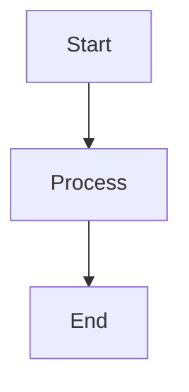
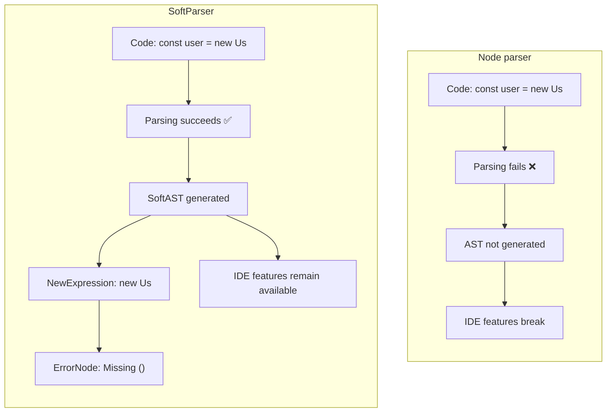

# Mermaid Test

Here's a simple Mermaid diagram:

```mermaid
graph TD
    A[Start] --> B[Process]
    B --> C[End]
```

And here's the flowchart from your post:

```mermaid
flowchart TB
    subgraph NodeParser["Node parser"]
        direction TB
        A1["Code: const user = new Us"] --> A2["Parsing fails ❌"]
        A2 --> A3["AST not generated"]
        A3 --> A4["IDE features break"]
    end

    subgraph SoftParser["SoftParser"]
        direction TB
        B1["Code: const user = new Us"] --> B2["Parsing succeeds ✅"]
        B2 --> B3["SoftAST generated"]
        B3 --> B4["NewExpression: new Us"]
        B4 --> B5["ErrorNode: Missing ()"]
        B3 --> B6["IDE features remain available"]
    end
```